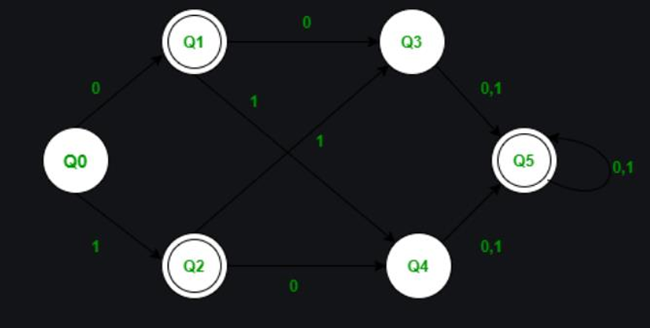
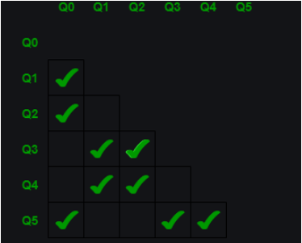
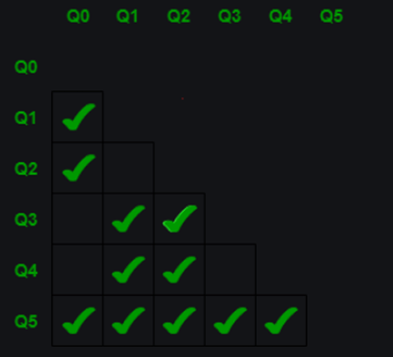
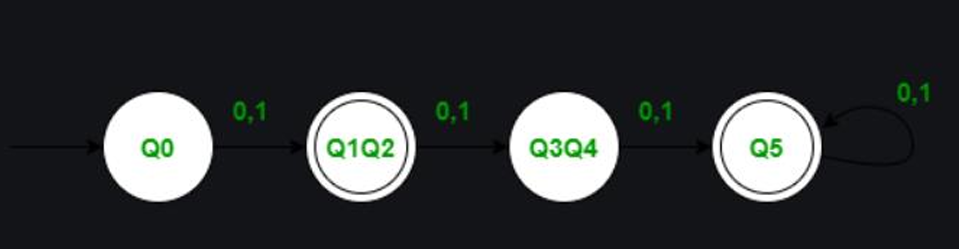

# DFA-Minimization
## Finite Automata:
Finite Automata (FA) is the simplest machine to recognize patterns. The finite automata or finite 
state machine is an abstract machine that has five elements or tuples. It has a set of states and rules 
for moving from one state to another but it depends upon the applied input symbol. Basically, it is 
an abstract model of a digital computer 
DFAs, also known as deterministic finite automata, are finite state machines that accept or reject 
character strings by parsing them through a sequence that is specific to each string. It is said to be 
"deterministic" when each string, and thus each state sequence, is distinct. A DFA parses a string 
of symbols through DFA automata, and each input symbol advances to the next possible state.
Because there are only a finite number of states that these machines can achieve, they are given the 
name finite. Only if a finite automaton can meet both requirements is it referred to as deterministic. 
DFAs are different from non-deterministic automata in that the latter can switch between numerous 
states and be active in several states simultaneously.
Minimization of DFA: 
DFA minimization stands for converting a given DFA to its equivalent DFA with minimum 
number of states. DFA minimization is also called as Optimization of DFA.
The DFA in its minimal form is called as a Minimal DFA.
The two popular methods for minimizing a DFA are –
i. Equivalence Method
ii. Myhill Nerode Theorem

Steps –
1. Create the pairs of all the states involved in DFA.
2. Mark all the pairs (Qa,Qb) such a that Qa is Final state and Qb is Non-Final State.
3. If there is any unmarked pair (Qa,Qb) such a that δ(Qa,x) and δ(Qb,x) is marked, then mark 
(Qa,Qb). 
Here x is a input symbol. Repeat this step until no more marking can be made.
We have checked for all the unmarked pairs but don’t need to stop here we need to continue this 
process until no more markings can be made.
4. Combine all the unmarked pairs and make them as a single state in the minimized DFA.

## Overview
This project implements the DFA minimization algorithm, which is used to reduce the number of states in a deterministic finite automaton (DFA) while preserving its behavior. DFA minimization is crucial for simplifying DFA representations and optimizing their performance.

The implementation is done in Python, providing a straightforward demonstration of how DFA minimization works.

## Features
- Accepts DFA as input in a specified format.
- Applies the minimization algorithm to reduce the DFA's number of states.
- Generates a minimized DFA with equivalent behaviour to the original DFA.

## Example   
Consider the following DFA 

Create the pairs of all the states involved in DFA and mark all the pairs (Qa,Qb) such a that Qa  is 
Final state and Qb is Non-Final State. 

• Check for the unmarked pair Q2,Q1 
• Check when x=0 : δ(Q2,0) = Q4 and δ(Q1,0) = Q3, check if the pair Q4,Q3 is marked and no it is not 
marked. 
• Check when x=1 : δ(Q2,1) = Q3 and δ(Q1,1) = Q4, check if the pair Q4,Q3 is marked and no it is not 
marked. 
• Hence we cannot mark the pair Q2,Q1. 
• Check for the unmarked pair Q3,Q0 
• Check when x=0 : δ(Q3,0) = Q5 and δ(Q0,0) = Q1, check if the pair Q5,Q1 is marked and no it is not 
marked. 
• Check when x=1 : δ(Q3,1) = Q5 and δ(Q0,1) = Q2, check if the pair Q5,Q2 is marked and no it is not 
marked. 
• Hence we cannot mark the pair Q3,Q0. 
• Check for the unmarked pair Q4,Q0 
• Check when x=0 : δ(Q4,0) = Q5 and δ(Q0,0) = Q1, check if the pair Q5,Q1 is marked and no it is not 
marked. 
• Check when x=1 : δ(Q4,1) = Q5 and δ(Q0,1) = Q2, check if the pair Q5,Q2 is marked and no it is not 
marked. 
• Hence we cannot mark the pair Q4,Q0. 
• Check for the unmarked pair Q4,Q3 
• Check when x=0 : δ(Q4,0) = Q5 and δ(Q3,0) = Q5, Such pair of state Q5,Q5 don’t exists. 
• Check when x=1 : δ(Q4,1) = Q5 and δ(Q3,1) = Q5, Such pair of state Q5,Q5 don’t exists. 
• Hence we cannot mark the pair Q4,Q3. 
• Check for the unmarked pair Q5,Q1 
• Check when x=0 : δ(Q5,0) = Q5 and δ(Q1,0) = Q3, check if the pair Q5,Q3 is marked and yes it is 
marked. 
• Hence we can mark the pair Q5,Q1. 
• Check for the unmarked pair Q5,Q2 
• Check when x=0 : δ(Q5,0) = Q5 and δ(Q1,0) = Q4, check if the pair Q5,Q4 is marked and 
yes it is marked. 
• Hence we can mark the pair Q5,Q2. 

• We have checked for all the unmarked pairs but don’t need to stop here we need to continue this process until 
no more markings can be made. 
• Check for the unmarked pair Q2,Q1 
• Check when x=0 : δ(Q2,0) = Q4 and δ(Q1,0) = Q3, check if the pair Q4,Q3 is marked and no it is not 
marked. 
• Check when x=1 : δ(Q2,1) = Q3 and δ(Q1,1) = Q4, check if the pair Q4,Q3 is marked and no it is not 
marked. 
• Hence we cannot mark the pair Q2,Q1. 
• Check for the unmarked pair Q3,Q0 
• Check when x=0 : δ(Q3,0) = Q5 and δ(Q0,0) = Q1, check if the pair Q5,Q1 is marked and yes it is 
marked. 
• Hence we can mark the pair Q3,Q0. 
• Check for the unmarked pair Q4,Q0 
• Check when x=0 : δ(Q3,0) = Q5 and δ(Q0,0) = Q1, check if the pair Q5,Q1 is marked and 
yes it is marked. 
• Hence we can mark the pair Q4,Q0. 
Combine all the unmarked pairs and make them as a single state in the minimized DFA. 
• The unmarked Pairs are Q2,Q1 and Q4,Q3 hence we combine them. 
 
Following is the Minimized DFA with Q1Q2 and Q3Q4 as the combined states.

